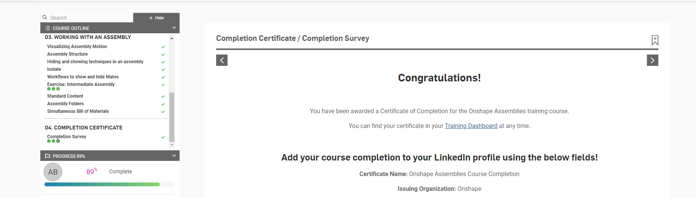

# Aaron Engineering 3 Notebook
This is my Engineering Notebook where I describe all the projects that I do at Engineering 3 at Charlottesville High School
test 
---
## Table of Contents
* [Table of Contents](#Table-of-Contents)
* [SwingArm](#SwingArm)
* [Assembly](#Assembly)

---

## SwingArm

### Description

Build a swing arm to pratice CAD

### Evidence

[my CAD](https://cvilleschools.onshape.com/documents/04a2a2682a175341dbda7c25/w/bbb4bfa104fd0f707b8df215/e/a370caffece3a41edc31a029)

### Image

### Reflection

It was pretty simple but complicated.I struggled to get the first curve on the circle.But in the end I firgured it out and it was a good assignment to improve my Cad skills.
---

## Assembly

### Description

Complete self pace assembly 

### Evidence

[SelfPace cource](https://learn.onshape.com/learn/course/fundamentals-onshape-assemblies/completion-certificate/completion-survey?page=3)

### Image

### Reflection

I learned more about assembles and got a better understanding up them.It was easy because the cource walked me through it.But now, I improved a useful skill that I will use later.
---

